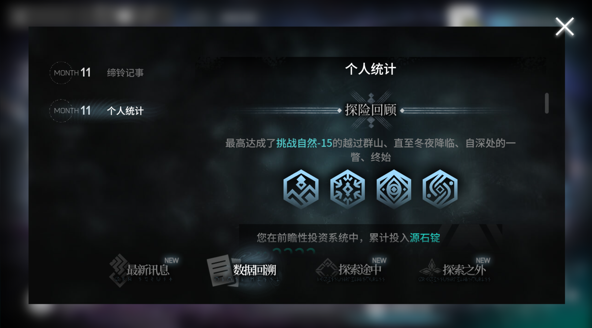

<!--  -->
- Beyond my academic and professional pursuits, I have a deep passion for a variety of activities that stimulate both mind and body. If you share any of these passions or hobbies, don’t hesitate to reach out! I always welcome a friendly chat on these topics.

# Sports

### Football

Football is one of the biggest endevours in my life!

- Start playing from 10 years old
- Captain, Football Team – South China University of Technology Affiliated Experimental School (Middle School Section): Led the team to a second-place finish in the Tianhe District Teenager Football League.
- Vice Captain, Mainland Student Association Football Team – The Chinese University of Hong Kong: Claimed championship in the 2024 Mainland Undergraduate League.
-  
- My favorite teams: Mancherster United, Dortmund, Guangzhou Evergrande (Now Guangzhou Team)

### Table Tennis

Table Tennis is also one of my love!

# ACG (Anime, Comics and Games)

I am a big fan of ACG culture!

### Fate Series
- Fate Stay Night
- Fate Grand Order
- Fate Extra

### K-ON
- one of my favorite light yuri anime 

### Boruto

### Arknights
- Integrated Stratege (Rougelike)
    - My proudest achievements:  earned all badges and finished all endings in the Expeditioner's Joklumarkar (commonly known as Sami Rouge) mode without the release of key operators, such as Mynar, Wis'adel and Logos
    -  
    -  
- Contingency Contract

# Technology

### VIM

### Stable Diffusion

# Food & Cooking
- I have a deep love for delicious food and enjoy experimenting with cooking. Whether it’s trying new recipes or perfecting my own, cooking is a creative outlet where I can blend flavors and techniques to craft enjoyable meals.